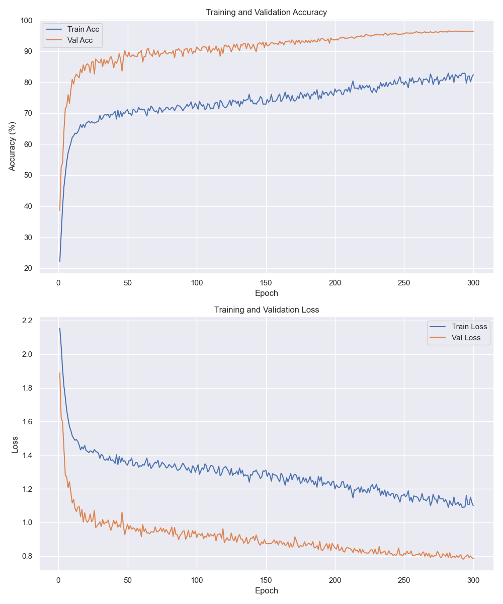

# ResNet-18 CIFAR-10 Baseline Report

Generated on: 2024-12-13 02:48:44

## Model Architecture

### Overview
- Base Architecture: ResNet-18
- Input Size: 32x32x3 (CIFAR-10 images)
- Total Parameters: 11,173,962
- Trainable Parameters: 11,173,962

## Training Hyperparameters

```python
data_dir = ./data
checkpoint_dir = ./checkpoints
batch_size = 128
device = mps
seed = 42
num_workers = 4
num_epochs = 300
learning_rate = 0.1
momentum = 0.9
weight_decay = 0.0002
nesterov = True
warmup_epochs = 5
min_lr = 1e-05
warmup_start_lr = 0.01
stochastic_depth_prob = 0.5
label_smoothing = 0.15
mixup_alpha = 0.4
cutmix_alpha = 1.0
randaugment = True
randaugment_n = 2
randaugment_m = 10
random_erasing_prob = 0.25
trivialaugment = False
drop_path_rate = 0.15
patience = 40
min_delta = 0.0005
num_classes = 10
use_se_blocks = True
```

## Performance Metrics

### Final Results
- Test Accuracy: 96.33%
- Test Loss: 0.7927
- Best Validation Accuracy: 96.58% (Epoch 282)
- Training Time: 7.40 hours

### Training Curves


## Comparison to Original ResNet-18

### Architectural Differences
- Base implementation follows the original ResNet-18 architecture
- Adapted for CIFAR-10 with appropriate input size handling
- Uses batch normalization and ReLU activation as in original paper

## Notes and Observations

### Training Process
- Model trained for 300 epochs
- Used mps for training
- Implemented early stopping with patience

### Challenges and Solutions
1. Initial Implementation:
   - Challenge: Adapting ResNet-18 for CIFAR-10
   - Solution: Modified initial convolution and pooling layers

2. Training Stability:
   - Challenge: Learning rate tuning
   - Solution: Implemented warmup and cosine annealing

3. Overfitting:
   - Challenge: Gap between train and validation accuracy
   - Solution: Added data augmentation and regularization

